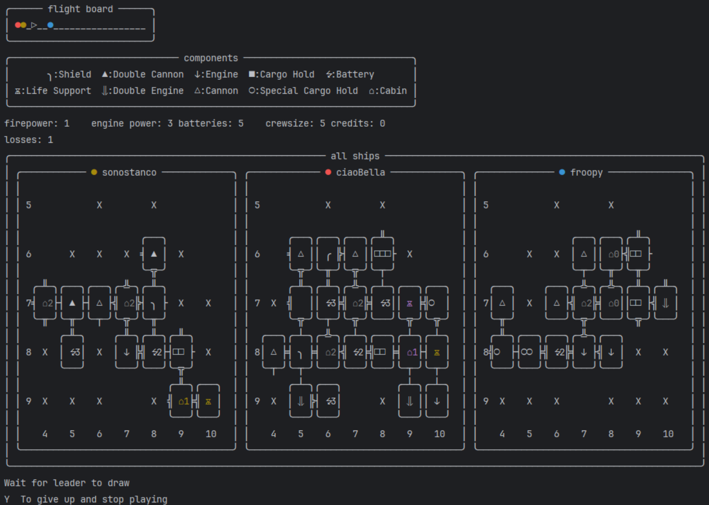
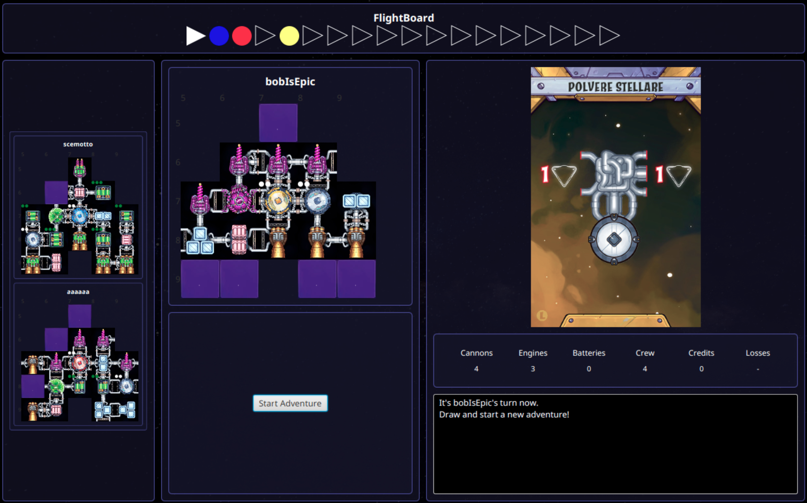

## About the Project

This project is a digital implementation of the board game **Galaxy Trucker**, developed as part of the Final Software Engineering Project for the academic year 2024/2025 at Politecnico di Milano by:

* [Tommaso Capone](https://github.com/capbros)
* [Francesco Cola](https://github.com/Colaveloper)
* [Lorenzo Carafa](https://github.com/LorenzoCarafa)
* [Francesco Canossi](https://github.com/froopy090)

The implementation supports the **complete rule set** of the game, including both the **Second Flight** and the optional **Test Flight** mode.

Each player can independently choose their preferred combination of interface (GUI or TUI) and communication protocol (Socket or RMI) and still take part in the same game.

The GUI is implemented in **JavaFX**, with responsive layouts for different screen sizes. The TUI supports **UTF-8 encoding**.

The server supports **multiple games simultaneously** and handles players using different technologies in the same match. If a player disconnects, the server continues by taking default actions. Players can reconnect using the same nickname and resume the game. If only one player remains, default actions are applied until the game ends.

## Features

| Feature          | Implemented | Feature                  | Implemented |
| ---------------- | ----------- | ------------------------ | ----------- |
| Simplified rules | ✔️          | Socket                   | ✔️          |
| Complete rules   | ✔️          | RMI                      | ✔️          |
| TUI              | ✔️          | Multiple games           | ✔️          |
| GUI              | ✔️          | Disconnection resilience | ✔️          |
| Test Flight mode | ✔️          | Persistence              | ❌           |

## Running the Application

The project is distributed as a single precompiled executable JAR file.

To run it:

```bash
java -jar GalaxyTruckers-1.0.jar
```

When launching the server, the host is first asked whether to start a **demo** session. If so, they can either:
- Use prefabricated ships to skip the building phase, or
- **Edit** them by playing the building phase. The resulting ships will be saved and used in future demo sessions.

> Tip: For the best experience in TUI mode, disable soft-wrap in the terminal.

Ensure that **Java 24** is installed.

## Documentation

* The entire project is covered with **JavaDoc**.
* A **high-level UML diagram** and **generated UML diagrams** (from the source code) are provided.
* The communication protocol between client and server is documented in the deliverables folder.

## Testing and Coverage

*Work in progress.*

## Screenshots




## Tools and Libraries

Libraries:

* **JUnit 4 / 5** – Unit testing
* **Mockito** – Mocking for tests
* **Jackson** – JSON handling
* **Guava** – Data structures and annotations
* **JavaFX** – GUI

Build:

* **Maven** with Shade and Compiler plugins (Java 24 target, Java 21+ runtime)
